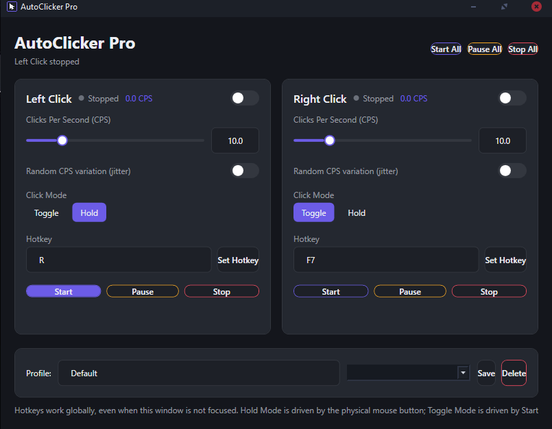

# AutoClicker Pro


A modern Windows Auto Clicker built with **C#**, **.NET 8**, **WPF**, and **MVVM**.

> **Latest Release:** **v1.0.2**

---

## Screenshot



---

## Features

- Independent Left & Right click settings
- Adjustable CPS (1–50)
- Manual Delay (0–1000 ms)
- Random CPS variation
- Hold Mode & Toggle Mode
- Global keyboard & mouse hotkeys
- Start / Pause / Stop controls
- Real-time CPS monitor
- Profile save/load/delete
- Dark UI
- Clean Exit button
- Lightweight and low CPU usage

---

## Download

Download the latest version from the Releases page:

## Download

Download the latest version from the **[Releases](https://github.com/fojizen/AutoClickerPro/releases/latest)** page.

---

## Build

```bash
dotnet restore
dotnet build -c Release
```

Publish as a single executable:

```bash
dotnet publish -c Release -r win-x64 --self-contained true -p:PublishSingleFile=true
```

---

## Notes

- Windows 10 / 11
- .NET 8
- Global keyboard and mouse hotkeys
- Supports Left, Right, Middle, XButton1 and XButton2 hotkeys
- Manual Delay is applied after the CPS interval
- Uses the Windows SendInput API
- Some games with kernel-level anti-cheat may block simulated input

---

## License

This project is licensed under the MIT License. See the [LICENSE](LICENSE) file for details.
